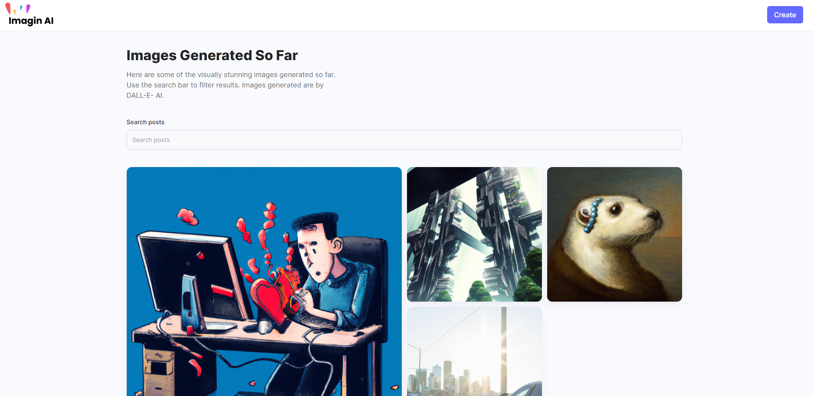
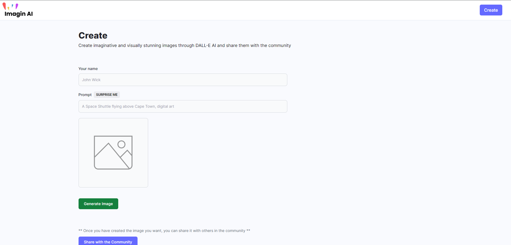

<!-- TABLE OF CONTENTS -->

# 📗 Table of Contents

- [📖 About the Project](#about-project)
  - [🛠 Built With](#built-with)
    - [Tech Stack](#tech-stack)
    - [Key Features](#key-features)
  - [🚀 Live Demo](#live-demo)
  - [🚀 Walkthrough Video](#walkthrough)
- [👥 Authors](#authors)
- [🔭 Future Features](#future-features)
- [🤝 Contributing](#contributing)
- [⭐️ Show your support](#support)
- [🙏 Acknowledgements](#acknowledgements)
- [📝 License](#license)

<!-- PROJECT DESCRIPTION -->

# 📖 [Imagine AI] 

### Imagine AI : Where imagination meets reality. Unleash your creativity with this cutting-edge image generation platform. Simply input your prompts, and watch as this AI brings your visions to life through stunning and personalized generated image.

## 🛠 Built With 

- Next js - Express.js

### Tech Stack 

  <ul>
    <li>Next.js</li>
    <li>tailwindcss</li>
    <li>file-saver</li>
    <li>canvas-confetti</li>
    <li>cloudinary</li>
    <li>node.js</li>
    <li>MongoDB</li>
    <li>openai image creation API</li>
  </ul>

<!-- Features -->

### Key Features 

- **[Create Images]**
- **[Responsive]**
- **[Share images with community]**

(<a href="#readme-top">back to top</a>)

<!-- LIVE DEMO -->

## 🚀 Live Demo 

<a href="https://ai-image-generation-rouge.vercel.app">Live demo</a>

## 🚀 Video Walkthrough 

<a href="https://drive.google.com/file/d/1tBnFrjKbWaI0yDRDkMtSBMnJClDCd64X/view?usp=sharing">Watch Video</a>

(<a href="#readme-top">back to top</a>)

<!-- AUTHORS -->

## 👥 Authors 

👤 Shayan

- GitHub: [@githubhandle](https://github.com/shayan1234554321)
- Twitter: [@twitterhandle](https://twitter.com/shayan123455432)
- LinkedIn: [LinkedIn](https://www.linkedin.com/in/shayan-khan20/)

(<a href="#readme-top">back to top</a>)

<!-- FUTURE FEATURES -->

## 🔭 Future Features 

- [ ] **[Authentication]**

(<a href="#readme-top">back to top</a>)

<!-- CONTRIBUTING -->

## 🤝 Contributing 

You can contribute to this project by writing an issue <a href="https://github.com/shayan1234554321/ai-image-generation/issues" >here</a>

(<a href="#readme-top">back to top</a>)

<!-- SUPPORT -->

## ⭐️ Show your support 

If you like this project please leave a ⭐️

(<a href="#readme-top">back to top</a>)

<!-- ACKNOWLEDGEMENTS -->

## 🙏 Acknowledgments 

I would like to thank <a href="https://www.youtube.com/@javascriptmastery" >Javascript Mastery</a> for the great follow up.

(<a href="#readme-top">back to top</a>)

<!-- LICENSE -->

## 📝 License 

This project is [Licensed](./LICENSE).

(<a href="#readme-top">back to top</a>)

